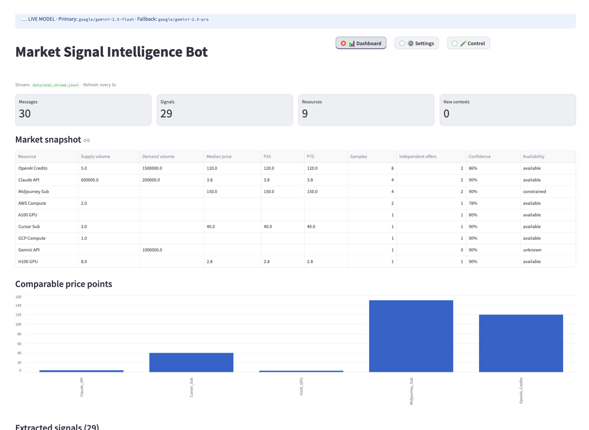

# Market Signal Intelligence Bot

A Streamlit application demonstrating a data pipeline: "Chat Stream → Market Signal Extraction → Aggregated Reporting". The project defaults to using OpenRouter for structured LLM extraction, but also supports a fully offline deterministic fake extractor.

📖 **[Read the comprehensive Architecture & Design Guide here](https://datafibers.github.io/chumi_task/)**



## 1. Requirements

- Python 3.9+
- OpenRouter API key (required when using real LLM models)

Install dependencies:

```bash
python -m pip install -r requirements.txt
```

## 2. OpenRouter Configuration

You can configure credentials and models via environment variables:

```bash
export OPENROUTER_API_KEY="your-api-key"
export OPENROUTER_MODEL="google/gemini-2.5-flash"
export OPENROUTER_FALLBACK_MODEL="google/gemini-2.5-pro"
```

Alternatively, after starting Streamlit, you can navigate to the `Settings` tab, enable Online (OpenRouter) mode, and fill in your API key, primary model, and fallback model. 

When you click `Save configuration`, the UI settings are automatically saved to `.streamlit/user_settings.json` locally, and will be restored on the next startup. This file is added to `.gitignore` so it won't be committed to Git. **It contains your plaintext API key, so only use it in your personal development environment.**

The Settings tab comes with several preset models, and you can also use custom model slugs:

- `google/gemini-3.8-flash`: Latest Flash, fast with strong complex reasoning
- `google/gemini-3.1-pro-preview`: High-quality reasoning, higher cost
- `google/gemini-2.5-flash`: Default, fast and cost-effective
- `google/gemini-2.5-pro`: Stronger reasoning, suitable as a fallback
- `anthropic/claude-sonnet-4.5`: Complex semantic extraction
- `openai/gpt-4.1-mini`: Fast structured extraction
- `openai/gpt-4.1`: Higher quality

## 3. Launching the UI

```bash
streamlit run dashboard.py
```

Open the local address shown in the terminal (usually `http://localhost:8501`).

The application has three main tabs (without a sidebar menu):

### Dashboard

Displays supply/demand, median price, P25/P75, resource trends, extracted signals, source message IDs, provenance, confidence, explanation, and pipeline errors. The Dashboard automatically polls the JSONL stream and SQLite state based on the configured refresh rate.

### Settings

Used to configure the OpenRouter API key, primary/fallback model, refresh interval, offline fake extractor, and the minimum acceptable golden test accuracy. When "Offline demo mode" is selected, the OpenRouter key and model configurations are automatically hidden.

### Control

Used to run golden regression tests and the demo replay. If the latest golden test score falls below the configured threshold, the `Run demo` button will be disabled.

## 4. Switching Real/Offline Modes in Settings

It is recommended to start the app with a single command:

```bash
streamlit run dashboard.py
```

After launching, go to the `Settings` tab and toggle the `Run mode`:

- **Live OpenRouter mode enabled**: Uses the provided OpenRouter API key, primary model, and fallback model.
- **Live OpenRouter mode disabled**: No API key is required, no network calls are made. It uses a deterministic fake extractor.

After saving the configuration, navigate to the `Control` tab. Click `Run golden tests` to verify the current mode, then click `Run demo` to process the demo data. Finally, return to the `Dashboard` to view the results. You do not need to restart the application to switch modes.

You can still use the `USE_FAKE_LLM` environment variable as a startup default, though it is no longer strictly necessary:

```bash
USE_FAKE_LLM=1 streamlit run dashboard.py
```

## 5. Simulating the Chat Data Stream

In a separate terminal, run:

```bash
python mock_producer.py --reset --interval 1
```

Parameters: `--reset` clears and recreates the stream; `--interval 1` sends one message every second; `--interval 0` replays the entire fixture instantly.

Recommended setup:

Terminal 1: `USE_FAKE_LLM=1 streamlit run dashboard.py`
Terminal 2: `python mock_producer.py --reset --interval 1`

## 6. Golden Regression Tests

Golden cases are located in `data/golden_cases.jsonl`, covering scenarios like price corrections, demand bounds, GPU supply, historical chatter, bundled offers, transaction commitment, availability, and irrelevant messages.

You can run the test suite without starting the UI:

```bash
USE_FAKE_LLM=1 python -c "from src.pipeline.evaluation import run_golden_suite; print(run_golden_suite())"
```

The output includes the number of cases, actual input rows tested, passed cases, field-level accuracy, individual case field checks, and the actual extracted signals for failed cases.

## 7. Configuration Variables

| Variable | Default Value | Purpose |
|---|---|---|
| `OPENROUTER_API_KEY` | none | OpenRouter credential |
| `OPENROUTER_MODEL` | `google/gemini-2.5-flash` | Primary extraction model |
| `OPENROUTER_FALLBACK_MODEL` | `google/gemini-2.5-pro` | Fallback extraction model |
| `USE_FAKE_LLM` | `0` | Enable the offline fake extractor |
| `REPORT_REFRESH_SECONDS` | `5` | Dashboard auto-refresh interval |
| `CONTEXT_WINDOW_SECONDS` | `120` | Group-local context inactivity window for messages without explicit replies |
| `GOLDEN_MIN_ACCURACY` | `0.75` | Minimum accuracy required to unlock the demo run |
| `CHAT_SOURCE_FILE` | `data/chat_messages.jsonl` | Original test fixture |
| `CHAT_STREAM_FILE` | `data/chat_stream.jsonl` | Simulated real-time stream |
| `MARKET_DB_FILE` | `data/market_signal.db` | SQLite state database |
| `SNAPSHOT_FILE` | `data/snapshot.json` | JSON snapshot output |

## 8. Pipeline Architecture

```text
data/chat_messages.jsonl
  -> mock producer
  -> data/chat_stream.jsonl
  -> RawMessage validation
  -> reply/time-window context assembly
  -> OpenRouter structured extraction
  -> deterministic normalization and deduplication
  -> SQLite signal state
  -> aggregation
  -> Streamlit dashboard + data/snapshot.json
```

SQLite stores processed context keys, signal provenance, and extraction failures. When users send price corrections, the pipeline uses source message IDs to replace the old signal, preventing outdated prices from lingering in the current market snapshot.

## 9. Cleanup and Replay

You can manually clean the state:

```bash
rm -f data/market_signal.db data/chat_stream.jsonl data/snapshot.json
python mock_producer.py --reset --interval 0
```

Alternatively, just click `Run demo` in the Control panel, which automatically resets the SQLite state and re-processes the fixture.

## 10. Design Documents

- 🌐 **[Live Project Guide (GitHub Pages)](https://datafibers.github.io/chumi_task/)**
- [docs/index.html](docs/index.html) — Comprehensive HTML guide with diagrams and exact chat examples
- [docs/DESIGN_NOTES.md](docs/DESIGN_NOTES.md) — Architecture and design decisions
- [docs/USE_CASES.md](docs/USE_CASES.md) — Adversarial scenarios and evaluation metrics
